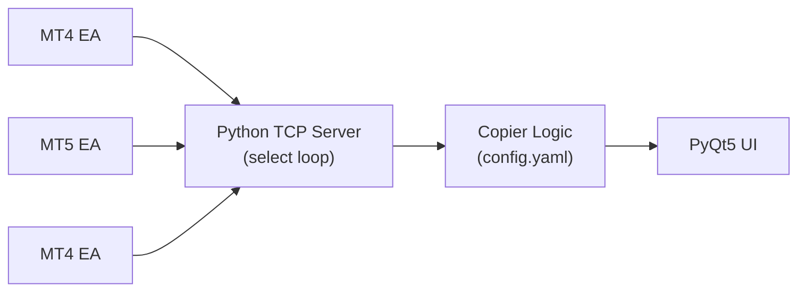
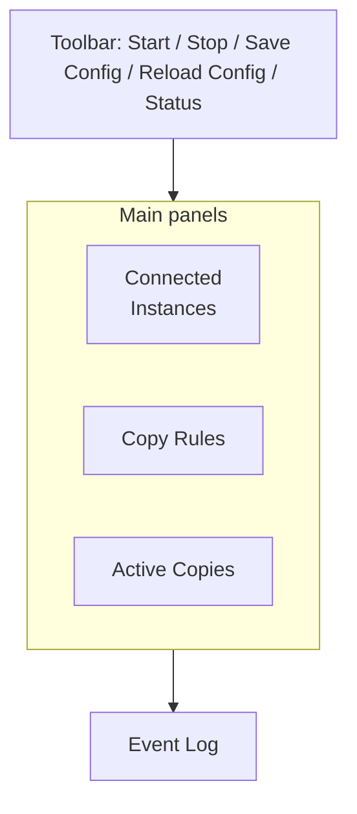

# Trade Copier

A Python application that copies trades in real time between MetaTrader 4 and MetaTrader 5 instances. The Python app acts as a TCP socket server; a lightweight Expert Advisor (EA) installed on each MetaTrader instance connects as a client and reports positions as they open and close.

---

## How It Works



- The **Python server** is the hub — one process, any number of MT clients.
- Each **EA** registers itself on connect, streams position changes, and executes `COPY_TRADE` / `CLOSE_TRADE` commands from the server.
- All messages are flat JSON over TCP, terminated with `\r\n`.
- **Configuration** lives in `config.yaml` at the project root (auto-created with defaults on first run).

---

## Prerequisites

| Requirement | Notes |
|---|---|
| Python 3.13+ | Tested with 3.13.x |
| [uv](https://docs.astral.sh/uv/getting-started/installation/) | Dependency manager; replaces pip/venv |
| MetaTrader 4 and/or MetaTrader 5 | Each instance **must be run in portable mode** (see below) |

---

## MetaTrader: Portable Mode (Required)

> **This step is mandatory.** The EA identifies each terminal by its `TerminalPath()` — the installation directory. In normal (non-portable) mode, MetaTrader stores all data in `%APPDATA%\MetaQuotes\Terminal\<opaque-hash>\`, making instances impossible to distinguish. In **portable mode** the data directory is the installation folder itself, so `TerminalPath()` returns a human-readable, unique path like `C:\Trading\MetaTrader4_ICMarkets\` — exactly what you configure in `config.yaml`.

### Setting up portable mode

1. **Install each MetaTrader terminal into its own dedicated folder**, one folder per broker/account.  
   _Good example:_  
   ```
   C:\Trading\MetaTrader4_ICMarkets\
   C:\Trading\MetaTrader5_Pepperstone\
   C:\Trading\MetaTrader4_FXCM\
   ```

2. **Create a file named `portable` (no extension) inside the terminal's root folder**, next to `terminal.exe` / `terminal64.exe`.  
   On Windows you can do this in PowerShell:
   ```powershell
   New-Item "C:\Trading\MetaTrader4_ICMarkets\portable" -ItemType File
   ```
   Alternatively, right-click → New → Text Document and remove the `.txt` extension.

3. **Launch the terminal** (double-click `terminal.exe`). MetaTrader will detect the `portable` file and switch to portable mode — data files (`config\`, `MQL4\`, `logs\`, etc.) will appear inside the installation folder.

4. Repeat for every terminal that will be connected to the Trade Copier.

> **Tip:** Rename each installation folder to something descriptive (e.g. `MetaTrader4_ICMarkets`) — the folder name is what the Python UI displays as the instance's "Directory" label.

---

## Installation

```powershell
# Clone the repository
git clone <repo-url>
cd trade-copier

# Install dependencies (creates .venv automatically)
uv sync

# Install PyQt5 (special handling required on Windows)
uv pip install PyQt5
```

> The `pyproject.toml` already pins `pyqt5-qt5==5.15.2`, which is the last Qt5 release with pre-built Windows wheels. No further action is needed after the two commands above.

---

## Installing the Expert Advisor

The `mql/` folder contains two EA files — one for MT4 and one for MT5 — along with the required header files.

### Files to copy

| File | Destination |
|---|---|
| `mq4/TradeCopierEA.mq4` | `<MT4 terminal>\MQL4\Experts\` |
| `mq5/TradeCopierEA.mq5` | `<MT5 terminal>\MQL5\Experts\` |
| `mq4/Sockets.mqh` | `<MT4 terminal>\MQL4\Include\` |
| `mq5/Sockets.mqh` | `<MT5 terminal>\MQL5\Include\` |
| `mql/SimpleJson.mqh` | `<terminal>\MQL4\Include\` _and_ `<terminal>\MQL5\Include\` |

> Because the terminals are in portable mode the `MQL4\` / `MQL5\` folders are inside the terminal's own installation directory.

### Compiling the EA

1. Open MetaEditor (press **F4** in MetaTrader, or launch `metaeditor.exe`).
2. Open the EA file and press **F7** (Compile). Fix any path issues if the headers are not found.
3. Refresh the Navigator panel in MetaTrader (right-click → Refresh).

### Attaching the EA to a chart

1. Open any chart (currency pair does not matter — the EA does not trade on its own).
2. Drag `TradeCopierEA` from the Navigator onto the chart.
3. Go to the **Inputs** tab and set the parameters:

| Parameter | Default | Description |
|---|---|---|
| `ServerHost` | `localhost` | IP or hostname of the machine running the Python app |
| `ServerPort` | `9000` | Must match `server.port` in `config.yaml` |
| `HeartbeatIntervalSec` | `30` | Seconds between keep-alive pings |
| `AccountUpdateIntervalSec` | `15` | Seconds between balance/equity updates |
| `TimerIntervalMs` | `100` | Poll interval in milliseconds (100 ms is reliable on Windows) |
| `Slippage` | `3` | Slippage tolerance in points when executing copy trades |

4. Enable **"Allow live trading"** on the Common tab. MT4 also needs **"Allow DLL imports"** for `Sockets.mqh`; MT5 uses native sockets instead. For MT5, add the EA's `ServerHost` value (for example `localhost` or `127.0.0.1`) to **Tools -> Options -> Expert Advisors -> Allow WebRequest for listed URL**.
5. Click **OK**. A status label will appear in the top-right corner of the chart:
   - 🟢 `TradeCopier CONNECTED [account]` — EA is connected to the Python server.
   - 🔴 `TradeCopier DISCONNECTED` — connection is down; the EA retries automatically.

> Attach the EA to one chart per terminal. You do not need to attach it to every open chart.

---

## Running the Python App

```powershell
uv run trade-copier
```

The UI will open. Click **▶ Start Server** in the toolbar to begin listening for EA connections.

### What happens on startup

1. `config.yaml` is read (created with defaults if it does not exist).
2. The TCP server binds to the configured host and port.
3. EAs connect and send a `REGISTER` message — the **Connected Instances** panel populates.
4. Each EA sends a `POSITIONS_SNAPSHOT` so the server can reconcile any positions that were open before the app started.

---

## The UI at a Glance



| Panel | Purpose |
|---|---|
| **Connected Instances** | Live status, balance, and equity for every connected terminal |
| **Copy Rules** | Add, edit, and delete rules that define what gets copied where |
| **Active Copies** | All in-flight and recently closed copy records with status colours |
| **Event Log** | Scrolling log of all server events (INFO / WARN / ERROR / TRADE / COPY) |

### Copy Rules

Click **+ Add Rule** or **✎ Edit Rule** to open the rule dialog:

- **Name** — a human-readable label for the rule.
- **Source** — the `terminal_path` of the source terminal (select from connected instances or type the path manually).
- **Destinations** — one or more destination terminals, each with its own lot-size settings.
- **Magic Numbers** — leave empty to copy _all_ magic numbers, or enter a comma-separated list to filter.
- **Symbol Map** — map source symbol names to destination symbol names (e.g. `XAUUSD` → `GOLD`).
- **Enabled** — rules can be toggled without deleting them.

Click **💾 Save Config** to persist changes to `config.yaml`.

---

## Configuration Reference (`config.yaml`)

The file is created automatically at `<project-root>/config.yaml` on first run. Edit it directly or use the UI.

```yaml
server:
  host: "localhost"            # IP to bind the TCP server on; use "0.0.0.0" to accept
                               # connections from other machines on the network
  port: 9000                   # TCP port; must match ServerPort in each EA
  heartbeat_interval: 30       # seconds between heartbeat pings to each EA
  account_update_interval: 15  # seconds between balance/equity update requests

copy_rules:
  - id: "rule_001"             # unique ID (auto-generated by the UI; do not change)
    name: "IC Markets MT4 → Pepperstone MT5"
    enabled: true

    # The terminal_path is exactly what TerminalPath() / TERMINAL_PATH returns
    # in the EA — i.e. the installation directory of the terminal in portable mode.
    source_terminal_path: "C:\\Trading\\MetaTrader4_ICMarkets"

    destinations:
      - terminal_path: "C:\\Trading\\MetaTrader5_Pepperstone"
        # Lot-size mode for this destination:
        #   fixed          — always open size_value lots
        #   proportional   — size_value % of the source position size (100 = same size)
        #   account_percent — size_value % of the destination account balance
        #   fixed_dollar   — size_value USD worth of the instrument (falls back to
        #                    size_value lots if price data is unavailable)
        size_mode: "proportional"
        size_value: 100          # 100 % → same size as source

        # Optional per-magic-number size overrides (takes priority over the above):
        size_by_magic:
          12345:
            size_mode: "fixed"
            size_value: 0.5

      - terminal_path: "C:\\Trading\\MetaTrader4_FXCM"
        size_mode: "fixed"
        size_value: 0.1

    # Magic number filter — leave as [] to copy ALL magic numbers from this source.
    # List specific values to copy only those EAs/strategies.
    magic_numbers: []            # example with filter: [12345, 67890]

    # Symbol map — only needed when broker symbol names differ.
    # source symbol → destination symbol
    symbol_map:
      "EURUSD": "EURUSD"
      "XAUUSD": "GOLD"
      "GBPUSD": "GBPUSDb"
```

> **Backslashes in paths:** YAML requires backslashes to be doubled (`\\`) inside quoted strings.

### How `terminal_path` is determined

The `terminal_path` value must exactly match what the EA reports. The easiest way to find the correct value:

1. Start the Python app and start the server.
2. Attach the EA to a chart in the terminal you want to configure.
3. The **Connected Instances** panel will show the terminal's directory name. Hover over the row to see the full path in a tooltip — that is the exact string to use in `config.yaml`.

Alternatively, in MetaEditor, open a script and run:
```mql4
Print(TerminalPath());   // MT4
```
```mql5
Print(TerminalInfoString(TERMINAL_PATH));  // MT5
```

---

## Running the Tests

```powershell
uv run pytest
```

121 unit and integration tests cover the copier logic, config manager, server, and a full trade open/close flow over a real TCP socket.

---

## Troubleshooting

### EA shows DISCONNECTED

- Confirm the Python app is running and the server has been started (green status in toolbar).
- Check `ServerHost` and `ServerPort` in the EA inputs match `config.yaml`.
- If the EA and the Python app are on different machines, set `host` to `0.0.0.0` in `config.yaml` and open the port in the Windows Firewall.
- Look at the Event Log panel for connection errors.

### Terminal appears in the UI but trades are not being copied

- Confirm a copy rule exists with the correct `source_terminal_path` and at least one destination.
- Confirm the rule is **enabled**.
- Check the **magic number filter** — if non-empty, only positions with those magic numbers are copied.
- Check the **symbol map** — if the source symbol is not listed and it differs at the destination, the EA will receive an unknown symbol and return a copy error.
- Red rows in the Active Copies panel indicate a copy error — hover over the row or check the Event Log for details.

### Duplicate connection warning in the log

Two EAs with the same `terminal_path` connected simultaneously. This happens if the EA is attached to more than one chart in the same terminal, or if the terminal was launched twice. Attach the EA to **one chart per terminal only**. The server will keep the newer connection and close the older one.

### PyQt5 installation fails on Windows

Run the install commands in this exact order:
```powershell
uv sync
uv pip install PyQt5
```
Do **not** use `uv add PyQt5` — it resolves a newer `pyqt5-qt5` wheel that has no Windows binary, causing the install to fail. The `pyproject.toml` already pins the correct version.

---

## Project Structure

```mermaid
flowchart TB
    Root["trade-copier/"]

    Root --> App["app/"]
    App --> MainPy["main.py<br/>entry point"]
    App --> ServerPy["server.py<br/>TCP server (threaded select loop)"]
    App --> CopierPy["copier.py<br/>copy logic and message dispatch"]
    App --> ConfigPy["config.py<br/>YAML config manager"]
    App --> ModelsPy["models.py<br/>dataclasses (MTInstance, CopyRecord, ...)"]
    App --> Ui["ui/"]
    Ui --> MainWindowPy["main_window.py"]
    Ui --> InstancesPanelPy["instances_panel.py"]
    Ui --> CopiesPanelPy["copies_panel.py"]
    Ui --> RulesPanelPy["rules_panel.py"]
    Ui --> LogPanelPy["log_panel.py"]

    Root --> Mq4["mq4/"]
    Mq4 --> Mq4["TradeCopierEA.mq4<br/>MT4 Expert Advisor"]
    Mq4 --> Sockets["Sockets.mqh / Sockets.<br/>socket client headers"]
    Mq4 --> SimpleJson["SimpleJson.mqh<br/>JSON serialisation header"]
    Mq5 --> Mq5["TradeCopierEA.mq5<br/>MT5 Expert Advisor"]
    Mq5 --> Sockets["Sockets.mqh / Sockets.<br/>socket client headers"]
    Mq5 --> SimpleJson["SimpleJson.mqh<br/>JSON serialisation header"]

    Root --> Tests["tests/<br/>pytest test suite (121 tests)"]

    Root --> Docs["docs/"]
    Docs --> ImplPlan["implementation-plan.md"]
    Docs --> E2ePlan["e2e-test-plan.md<br/>manual end-to-end test cases"]

    Root --> ConfigYaml["config.yaml<br/>auto-created on first run"]
    Root --> Pyproject["pyproject.toml"]
```


