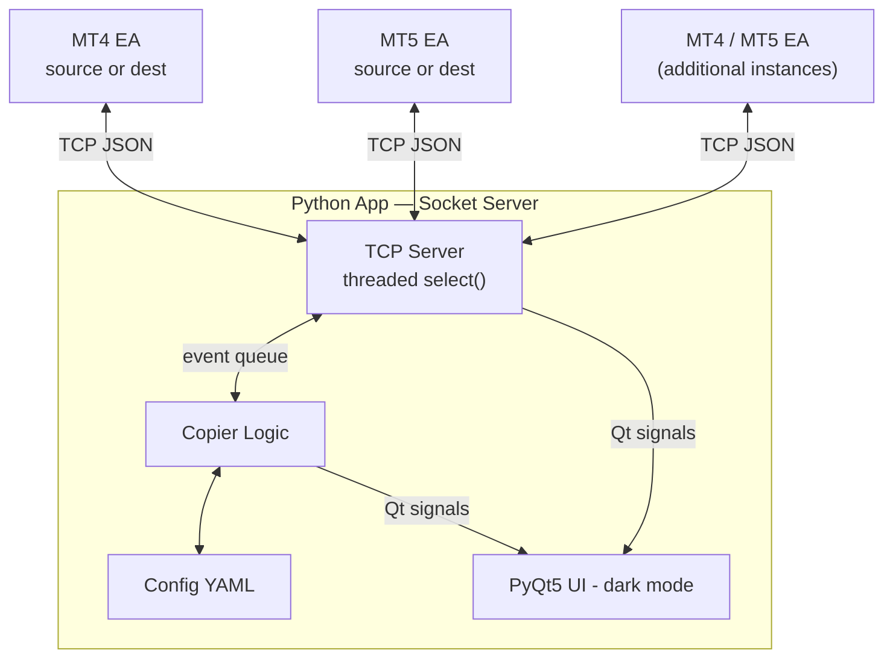
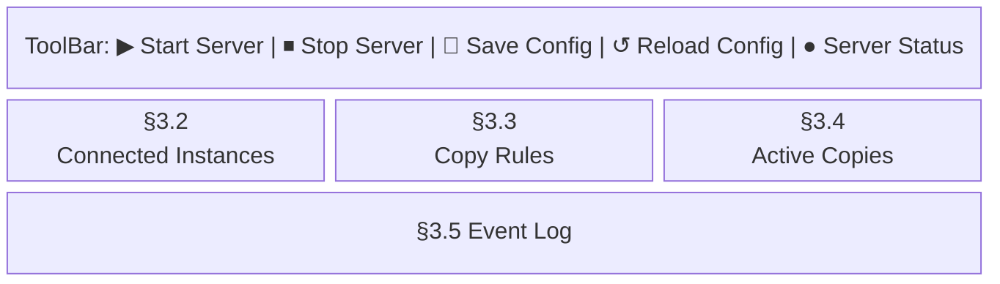

# Trade Copier – Implementation Plan

## Overview

A Python application acts as a TCP socket **server**. Each MetaTrader 4 or MetaTrader 5
instance runs a lightweight **Expert Advisor (EA)** that connects as a socket client, using
the project's existing `Sockets.mqh` and `SimpleJson.mqh` headers. The Python app copies
market-execution trades in real time between any configured source/destination pairs,
with a dark-mode PyQt5 UI for monitoring and configuration.

---

## Architecture



- **Python App** = TCP socket server — one server, many MT clients
- **MT4/MT5 EAs** = socket clients — same connection pattern as the existing `BullseyeLiveTrading` reference EAs
- **JSON over TCP**, messages terminated with `\r\n`
- **Configuration** stored in `config.yaml` at the project root

---

## Project Structure

```
trade-copier/
├── docs/
│   └── implementation-plan.md      (this file)
├── mql/
│   ├── Sockets.mqh                 (existing)
│   ├── SimpleJson.mqh              (existing)
│   ├── TradeCopierEA.mq4           (Phase 1)
│   └── TradeCopierEA.mq5           (Phase 1)
├── app/
│   ├── __init__.py
│   ├── main.py                     (Phase 3 – entry point)
│   ├── server.py                   (Phase 2 – TCP server)
│   ├── copier.py                   (Phase 2 – copy logic)
│   ├── config.py                   (Phase 2 – YAML config)
│   ├── models.py                   (Phase 2 – dataclasses)
│   └── ui/
│       ├── __init__.py
│       ├── main_window.py          (Phase 3 – main window)
│       ├── instances_panel.py      (Phase 3 – connected MT instances)
│       ├── rules_panel.py          (Phase 3 – copy rules config)
│       ├── copies_panel.py         (Phase 3 – active/recent copied trades)
│       └── log_panel.py            (Phase 3 – scrolling event log)
├── config.yaml                     (auto-created on first run)
└── requirements.txt
```

---

## Message Protocol

All messages are flat JSON objects (no nesting), terminated with `\r\n`, matching the
existing `SimpleJson.mqh` format.

### EA → Python Server

| `type` | Trigger | Key Fields |
|---|---|---|
| `REGISTER` | On first connect | `terminal_path` **(primary identifier)**, `platform`, `broker`, `account`, `account_type` (demo/real), `currency`, `leverage`, `balance`, `equity`, `margin`, `free_margin` |
| `ACCOUNT_UPDATE` | Every N seconds | `balance`, `equity`, `margin`, `free_margin` |
| `POSITIONS_SNAPSHOT` | After REGISTER and on every reconnect | `count`, `positions` (semicolon-separated records: `ticket\|symbol\|direction\|lots\|open_price\|sl\|tp\|magic\|open_time\|comment`) |
| `TRADE_OPENED` | New position detected in position diff | `ticket`, `symbol`, `direction` (buy/sell), `lots`, `open_price`, `sl`, `tp`, `magic`, `open_time`, `comment` |
| `TRADE_CLOSED` | Position disappears in position diff | `ticket`, `symbol`, `direction`, `lots`, `close_price`, `profit`, `magic`, `close_time` |
| `COPY_RESULT` | After executing a `COPY_TRADE` command | `copy_id`, `success` (true/false), `ticket`, `open_price`, `error` |
| `CLOSE_RESULT` | After executing a `CLOSE_TRADE` command | `copy_id`, `success` (true/false), `close_price`, `error` |
| `HEARTBEAT` | Every N seconds | `timestamp` |

### Python Server → EA

| `type` | Purpose | Key Fields |
|---|---|---|
| `ACK_REGISTER` | Confirm registration | `terminal_path` (echoed back as confirmation) |
| `COPY_TRADE` | Open a position on the destination | `copy_id` (UUID), `symbol`, `direction`, `lots`, `sl`, `tp`, `magic`, `comment` |
| `CLOSE_TRADE` | Close a position on the destination | `copy_id`, `ticket` |
| `HEARTBEAT` | Keep-alive | `timestamp` |

---

## Implementation Phases

---

### Phase 1 – MQL Expert Advisors

Two files: `TradeCopierEA.mq4` and `TradeCopierEA.mq5`. Both follow the same logic
pattern but use their respective platform APIs. Files go in `mql/` alongside the
existing headers.

#### 1.1 Input Parameters

```
input string  ServerHost               = "localhost";
input ushort  ServerPort               = 9000;
input int     HeartbeatIntervalSec     = 30;
input int     AccountUpdateIntervalSec = 15;
input int     TimerIntervalMs          = 100;   // poll interval in milliseconds
input int     Slippage                 = 3;     // points
```

#### 1.2 Global State

```mql
ClientSocket* glbSocket = NULL;
bool          isConnected = false;
datetime      lastHeartbeat = 0;
datetime      lastAccountUpdate = 0;

struct TrackedPosition {
    long     ticket;
    string   symbol;
    int      direction;    // OP_BUY/OP_SELL (MT4) | POSITION_TYPE_BUY/SELL (MT5)
    double   lots;
    double   openPrice;
    double   sl;
    double   tp;
    int      magic;
    string   comment;
    datetime openTime;
};

TrackedPosition trackedPositions[];
int             trackedCount = 0;
```

#### 1.3 EA Lifecycle

**`OnInit`**
1. Set `EventSetMillisecondTimer(TimerIntervalMs)` (default 100ms). Windows timer
   granularity is ~16ms, so 100ms fires reliably. `EventSetTimer()` is not used
   because it only accepts whole seconds.
2. Create chart status label (see §1.7).
3. Initialise `trackedPositions` by scanning all currently open positions (prevents
   false `TRADE_OPENED` events on EA attach).

**`OnDeinit`**
1. `EventKillTimer()`.
2. Update chart label to DISCONNECTED state.
3. Delete and null the socket.

**`OnTimer`** (fires every 100ms by default)
1. `HandleConnection()`.
2. If connected:
   - `ProcessIncomingMessages()`.
   - `CheckPositionChanges()`.
   - `MaybeSendAccountUpdate()`.
   - `MaybeSendHeartbeat()`.

> **MT5 only — `OnTrade()`:** MT5 fires `OnTrade()` immediately whenever the trading
> environment changes (position opened or closed). The MT5 EA implements `OnTrade()`
> to call `CheckPositionChanges()` directly, giving near-zero detection latency
> independent of the timer interval. `OnTimer` remains as a safety net for the
> connection loop and heartbeats. MT4 has no equivalent event; polling via
> `EventSetMillisecondTimer` is the only option.

#### 1.4 `HandleConnection()`

```
If socket == NULL:
    Create new ClientSocket(ServerHost, ServerPort)
    If IsSocketConnected():
        isConnected = true
        Update chart label → GREEN
        Send REGISTER
        Send POSITIONS_SNAPSHOT
    Else:
        Delete socket, set NULL

Else if socket exists but !IsSocketConnected():
    isConnected = false
    Update chart label → RED
    Delete socket, set NULL
```

#### 1.5 `CheckPositionChanges()`

Build a **current set** of open positions from the broker API.

**Filter rule:** Skip any position whose `comment` starts with `"COPY_"`. These are
positions placed by this EA on behalf of the Python server and must not be
re-reported as new trades (this is the primary copy-loop prevention mechanism).

**MT4:** Iterate `OrdersTotal()` / `OrderSelect(i, SELECT_BY_POS)` where `OrderType() < 2`.  
**MT5:** Iterate `PositionsTotal()` / `PositionGetTicket(i)`.

```
For each current position not in trackedPositions:
    → Send TRADE_OPENED
    → Add to trackedPositions

For each trackedPosition not in current set:
    → Retrieve close details from order history
    → Send TRADE_CLOSED
    → Remove from trackedPositions
```

#### 1.6 `ExecuteCopyTrade(copy_id, symbol, direction, lots, sl, tp, magic)`

1. Validate symbol is in Market Watch (add if needed).
2. Get current market price (Ask for buy, Bid for sell).
3. Clamp lots to broker's `SYMBOL_VOLUME_MIN` / `SYMBOL_VOLUME_MAX`.
4. Round lots down to `SYMBOL_VOLUME_STEP`.
5. Normalise `sl` / `tp` to `SYMBOL_DIGITS` (skip if 0).
6. Build comment: `"COPY_" + copy_id` (truncated to 31 chars for MT4).
7. Execute order:
   - **MT4:** `OrderSend(symbol, type, lots, price, slippage, sl, tp, comment, magic, 0, color)`
   - **MT5:** `MqlTradeRequest` / `OrderSend` / `MqlTradeResult`
8. Send `COPY_RESULT`:
   - Success: `success=true`, `ticket=<ticket>`, `open_price=<fill_price>`
   - Failure: `success=false`, `error=<ErrorDescription(GetLastError())>`
9. On success: add position to `trackedPositions` immediately (with `COPY_` comment
   already set) so it is never reported as a TRADE_OPENED.

#### 1.7 `ExecuteCloseTrade(copy_id, ticket)`

1. Verify ticket exists and is open.
2. Get current market price for the opposing direction.
3. Execute close:
   - **MT4:** `OrderClose(ticket, lots, price, slippage)`
   - **MT5:** `TRADE_ACTION_DEAL` on `PositionSelectByTicket(ticket)`
4. Send `CLOSE_RESULT` (success or failure).
5. Remove from `trackedPositions`.

#### 1.8 Chart Status Label

```
ObjectCreate(0, "TC_Status", OBJ_LABEL, 0, 0, 0)
OBJPROP_CORNER  = CORNER_RIGHT_UPPER
OBJPROP_XDISTANCE = 10
OBJPROP_YDISTANCE = 20
OBJPROP_FONTSIZE = 10
OBJPROP_FONT    = "Consolas"

Connected:    color=clrLimeGreen  text="⬤ TradeCopier  CONNECTED   [account]"
Disconnected: color=clrRed        text="⬤ TradeCopier  DISCONNECTED"
```

#### 1.9 `ProcessIncomingMessages()`

```mql
string msg;
do {
    msg = glbSocket.Receive("\r\n");
    if (msg != "") RouteMessage(msg);
} while (msg != "");
```

`RouteMessage` dispatches on `type`:
- `COPY_TRADE` → `ExecuteCopyTrade(...)`
- `CLOSE_TRADE` → `ExecuteCloseTrade(...)`
- `ACK_REGISTER` → log confirmed `terminal_path`
- `HEARTBEAT` → no action needed

#### 1.10 MT4 vs MT5 API Differences Summary

| Concern | MT4 | MT5 |
|---|---|---|
| Open positions | `OrdersTotal()` + `OrderSelect(SELECT_BY_POS)` + `OrderType() < 2` | `PositionsTotal()` + `PositionGetTicket()` |
| Place order | `OrderSend(symbol, type, lots, price, slip, sl, tp, comment, magic)` | `MqlTradeRequest` + `OrderSend` + `MqlTradeResult` |
| Close order | `OrderClose(ticket, lots, price, slip)` | `TRADE_ACTION_DEAL` targeting position ticket |
| Account info | `AccountBalance()`, `AccountEquity()`, `AccountNumber()`, `AccountCompany()`, `AccountCurrency()`, `AccountLeverage()`, `AccountFreeMargin()`, `AccountMargin()`, `IsDemo()` | `AccountInfoDouble(ACCOUNT_BALANCE)`, `AccountInfoInteger(ACCOUNT_LOGIN)`, etc. |
| **Terminal path** | **`TerminalPath()`** | **`TerminalInfoString(TERMINAL_PATH)`** |
| **Instant position event** | **None — polling only** | **`OnTrade()` fires on every position change** |
| Symbol digits | `MarketInfo(symbol, MODE_DIGITS)` | `SymbolInfoInteger(symbol, SYMBOL_DIGITS)` |
| Symbol prices | `MarketInfo(symbol, MODE_BID/ASK)` | `SymbolInfoDouble(symbol, SYMBOL_BID/ASK)` |
| Order history | `OrderSelect(ticket, SELECT_BY_TICKET)` + check `OrderCloseTime() > 0` | `HistorySelectByPosition(ticket)` + `HistoryDealGetTicket` |
| Close price (history) | `OrderClosePrice()` | `HistoryDealGetDouble(deal, DEAL_PRICE)` |

---

### Phase 2 – Python Core

#### 2.1 `models.py` – Data Classes

```python
@dataclass
class MTInstance:
    terminal_path: str        # installation directory — primary identifier
                              # e.g. "C:\Trading\MetaTrader4_ICMarkets"
                              # reported by the EA via TerminalPath() / TERMINAL_PATH
    platform: str             # "MT4" | "MT5"
    broker: str
    account: str
    account_type: str         # "demo" | "real"
    currency: str
    leverage: int
    balance: float
    equity: float
    margin: float
    free_margin: float
    connected: bool
    connected_at: datetime | None
    last_heartbeat: datetime | None

    @property
    def display_name(self) -> str:
        # Last path component used as a human-readable label in the UI
        return Path(self.terminal_path).name

@dataclass
class OpenPosition:
    ticket: str
    symbol: str
    direction: str            # "buy" | "sell"
    lots: float
    open_price: float
    sl: float
    tp: float
    magic: int
    open_time: datetime
    comment: str

@dataclass
class CopyRecord:
    copy_id: str
    source_terminal_path: str
    source_ticket: str
    dest_terminal_path: str
    dest_ticket: str | None
    symbol_source: str
    symbol_dest: str
    direction: str
    source_lots: float
    dest_lots: float
    magic: int
    sl: float
    tp: float
    status: str               # "pending" | "open" | "pending_close" | "closed" | "error"
    error: str
    opened_at: datetime
    closed_at: datetime | None

@dataclass
class SizeConfig:
    mode: str                 # "fixed" | "proportional" | "account_percent" | "fixed_dollar"
    value: float

@dataclass
class DestinationConfig:
    terminal_path: str
    size: SizeConfig
    size_by_magic: dict[int, SizeConfig]

@dataclass
class CopyRule:
    rule_id: str
    name: str
    enabled: bool
    source_terminal_path: str
    destinations: list[DestinationConfig]
    magic_numbers: list[int]  # empty = copy all
    symbol_map: dict[str, str]
```

#### 2.2 `config.py` – Configuration Manager

Responsibilities:
- Load `config.yaml` on startup; create with defaults if absent.
- Expose typed accessors: `get_rules()`, `get_server_config()`.
- `save()` writes back to YAML atomically (write temp, rename).
- `reload()` re-reads from disk.

Default `config.yaml`:

```yaml
server:
  host: "localhost"
  port: 9000
  heartbeat_interval: 30
  account_update_interval: 15

copy_rules: []
# Example rule (uncomment and fill in):
# copy_rules:
#   - id: "rule_001"
#     name: "My first copy rule"
#     enabled: true
#     source_instance_id: "IC_Markets_MT4_123456"
#     destinations:
#       - instance_id: "Pepperstone_MT5_789012"
#         size_mode: "proportional"
#         size_value: 100
#         size_by_magic: {}
#     magic_numbers: []
#     symbol_map:
#       "EURUSD": "EURUSD"
#       "XAUUSD": "GOLD"
```

#### 2.3 `server.py` – TCP Server

Uses Python's `threading` module and `socket.select()` — no asyncio. Keeps the design
simple and avoids asyncio/Qt event-loop conflicts.

```python
class TradeCopierServer:
    def __init__(self, host, port, on_event: Callable[[dict], None]):
        ...

    def start(self) -> None:
        # Bind, listen, start background thread

    def stop(self) -> None:
        # Close server socket, signal thread to exit

    def send(self, instance_id: str, message: dict) -> bool:
        # Serialise to JSON + "\r\n", write to client socket
        # Returns False if instance not connected

    def _server_loop(self) -> None:
        # select() loop: accept new connections, read from existing
        # Calls self._on_event(dict) for each parsed message

    def _handle_line(self, conn_id: str, line: str) -> None:
        # Parse JSON, inject conn_id, call on_event callback
```

**Thread safety:** The server thread owns all socket objects. The UI/copier thread
calls `server.send()` via a `threading.Lock`-protected queue consumed by the server
thread. Events flow from server thread → UI via a `queue.Queue`, polled by a QTimer.

#### 2.4 `copier.py` – Trade Copy Logic

```python
class TradeCopier:
    def __init__(self, config: ConfigManager, server: TradeCopierServer,
                 on_log: Callable[[str, str], None]):
        self.instances: dict[str, MTInstance] = {}         # keyed by terminal_path
        self.source_positions: dict[str, dict[str, OpenPosition]] = {}
        self.active_copies: dict[str, CopyRecord] = {}
        # key: (source_terminal_path, source_ticket)
        self._source_key_to_copy_id: dict[tuple, str] = {}

    def handle_message(self, instance_id: str, msg: dict) -> None:
        dispatch on msg["type"]

    def _on_register(self, instance_id, msg): ...
    def _on_account_update(self, instance_id, msg): ...
    def _on_positions_snapshot(self, instance_id, msg): ...
    def _on_trade_opened(self, instance_id, msg): ...
    def _on_trade_closed(self, instance_id, msg): ...
    def _on_copy_result(self, instance_id, msg): ...
    def _on_close_result(self, instance_id, msg): ...
    def _on_heartbeat(self, instance_id, msg): ...

    def _trigger_copy(self, rule, dest_cfg, source_instance_id, position): ...
    def _trigger_close(self, record): ...
    def _calc_lots(self, rule, dest_cfg, position, dest_instance): float: ...
    def _apply_symbol_map(self, rule, symbol) -> str: ...
    def _is_magic_allowed(self, rule, magic) -> bool: ...
```

**`_on_trade_opened` logic:**
```
For each enabled CopyRule where rule.source == source_instance_id:
    If magic not allowed by rule → skip
    For each destination in rule.destinations:
        dest_symbol = _apply_symbol_map(rule, position.symbol)
        dest_lots   = _calc_lots(rule, dest_cfg, position, dest_instance)
        copy_id     = uuid4().hex
        Record CopyRecord(copy_id, status="pending", ...)
        server.send(dest_instance_id, COPY_TRADE message)
```

**`_on_trade_closed` logic:**
```
Find CopyRecord by (source_instance_id, source_ticket)
If record.dest_ticket is not None:
    server.send(record.dest_instance_id, CLOSE_TRADE message)
    record.status = "pending_close"
Else:
    record.pending_close = True   # dest hasn't filled yet
```

**`_on_copy_result` logic:**
```
Record = active_copies[copy_id]
If success:
    record.dest_ticket = ticket
    record.status = "open"
    If record.pending_close:
        server.send(dest, CLOSE_TRADE)
        record.status = "pending_close"
Else:
    record.status = "error"
    record.error = msg["error"]
    log ERROR
```

**`_on_positions_snapshot` reconciliation:**
```
For each position in snapshot that has no existing CopyRecord:
    Treat as TRADE_OPENED — trigger copies
For each active CopyRecord (source=this instance) whose source_ticket
is NOT in the snapshot:
    Treat as TRADE_CLOSED — trigger closes
```

**Lot-size calculation (`_calc_lots`):**

| Mode | Formula |
|---|---|
| `fixed` | `size_value` |
| `proportional` | `source_lots * (size_value / 100)` |
| `account_percent` | `(dest_balance * size_value / 100) / (source_balance / source_lots)` |
| `fixed_dollar` | `size_value / approx_pip_value` (falls back to `fixed` if unknown) |

Then clamp to `[0.01, 500]` as a safety guard; EA performs its own broker-level clamping.

---

### Phase 3 – Python UI (PyQt5, Dark Mode)

Use `qdarkstyle` applied globally: `app.setStyleSheet(qdarkstyle.load_stylesheet())`.

#### 3.1 Main Window Layout



Three-column splitter (resizable) on top; fixed-height log at bottom.

#### 3.2 Instances Panel (`instances_panel.py`)

`QTableWidget`, columns:

| Status | Directory | Platform | Broker | Account | Type | Balance | Equity | Positions |
|---|---|---|---|---|---|---|---|---|
| ⬤ | MetaTrader4_ICMarkets | MT4 | IC Markets | 123456 | DEMO | $10,000 | $9,950 | 3 |

- **Directory** column shows `Path(terminal_path).name` (the folder name). Full path shown as tooltip on hover.
- Status dot: green (connected) / grey (disconnected, remembered from config).
- Rows updated via Qt signal `instance_updated(MTInstance)` emitted from main thread.
- Right-click: "Copy terminal path", "View open positions".

#### 3.3 Copy Rules Panel (`rules_panel.py`)

`QTableWidget`, columns: Name, Source, →, Destination(s), Magic Filter, Size Mode, Enabled.

Toolbar buttons: **[+ Add Rule]  [✎ Edit Rule]  [✕ Delete Rule]**.

**Edit Rule Dialog (`QDialog`):**
- Name (QLineEdit)
- Source: QComboBox populated from known instances; displays folder name (`Path(terminal_path).name`) with full path as tooltip; free-text entry also allowed
- Destinations table: terminal_path | size mode | size value | [+ Add] [- Remove]
- Magic numbers: QLineEdit comma-separated ("all" means empty list)
- Symbol map: QTableWidget key/value with [+ Add row] [- Remove row]
- Enabled: QCheckBox
- [Save] [Cancel]

#### 3.4 Active Copies Panel (`copies_panel.py`)

`QTableWidget`, columns:

| Copy ID | Source | Src Ticket | Symbol | Dir | Src Lots | Dest | Dest Ticket | Dest Lots | Status | Time |
|---|---|---|---|---|---|---|---|---|---|---|

Row colours:
- `pending` → amber
- `open` → green (muted)
- `pending_close` → amber
- `closed` → grey (dimmed)
- `error` → red

Toolbar: **[Show closed]** toggle, **[Clear closed]** button.

#### 3.5 Event Log Panel (`log_panel.py`)

`QPlainTextEdit` (read-only, monospace `Consolas 9pt`), max 5,000 lines.
Auto-scrolls to bottom unless user has scrolled up.

Colour coding (applied via HTML or ANSI-style prepend in dark theme):
- `[INFO]` → white
- `[WARN]` → yellow
- `[ERROR]` → tomato red
- `[TRADE]` → cyan
- `[COPY]` → light green

Toolbar: **[Clear]** button, **[Save log…]** button.

#### 3.6 Server Status Indicator

Right side of toolbar:
- Green circle + "Running on localhost:9000" when server is active.
- Red circle + "Stopped" when not running.
- Orange circle + "Starting…" during startup.

#### 3.7 `main.py` – Entry Point

```python
def main():
    app = QApplication(sys.argv)
    app.setStyleSheet(qdarkstyle.load_stylesheet(qt_api="pyqt5"))

    config = ConfigManager("config.yaml")

    event_queue = queue.Queue()
    server = TradeCopierServer(
        host=config.server.host,
        port=config.server.port,
        on_event=lambda msg: event_queue.put(msg),
    )
    copier = TradeCopier(config, server, on_log=...)

    window = MainWindow(config, server, copier, event_queue)
    window.show()

    # QTimer polls event_queue every 50ms and dispatches to UI
    timer = QTimer()
    timer.timeout.connect(window.process_events)
    timer.start(50)

    sys.exit(app.exec_())
```

---

## Edge Cases & Risk Mitigation

| Risk | Mitigation |
|---|---|
| **Copy loop** | EA filters `TRADE_OPENED` for positions with `comment.startswith("COPY_")`. Python also ignores `TRADE_OPENED` from a destination instance if the ticket matches a known `COPY_RESULT`. |
| **Reconnect with missed TRADE_OPENED** | On reconnect EA sends `POSITIONS_SNAPSHOT`. Python reconciles: any position not already in `active_copies` triggers a fresh copy. |
| **Reconnect with missed TRADE_CLOSED** | Reconciliation: any `active_copies` source ticket absent from snapshot → trigger close at destination. |
| **Close arrives before copy fills** | `CopyRecord.pending_close = True`. On `COPY_RESULT`, if `pending_close`, immediately send `CLOSE_TRADE`. |
| **Destination not connected at copy time** | Log `WARN`; store as `CopyRecord(status="pending")`. When destination connects and sends `POSITIONS_SNAPSHOT` (none), reconciliation finds the pending record and retries the copy. |
| **Symbol not available at destination** | EA sends `COPY_RESULT(success=false, error=…)`. Python logs `ERROR`, marks record as `error`, highlights rule in red in UI. |
| **Lot size out of broker bounds** | EA clamps to symbol min/max/step and logs a warning. Python notes adjusted lots in the Copies panel. |
| **Stop level too tight** | EA gets `ERR_INVALID_STOPS` from broker. Returns `COPY_RESULT(success=false)`. Python logs error. |
| **Insufficient margin** | EA returns `COPY_RESULT(success=false, error=ERR_NOT_ENOUGH_MONEY)`. Python logs error + shows in UI. |
| **Market closed at destination** | EA returns `COPY_RESULT(success=false, error=ERR_MARKET_CLOSED)`. Python logs and optionally retries at market open. |
| **Duplicate registration** | If two EAs connect with the same `terminal_path`, Python logs `WARN` and uses the newer connection; the old socket is closed. |
| **Partial position close (MT5)** | Partial close creates a new ticket for the remaining portion. Python sees `TRADE_CLOSED` (old ticket, partial lots) and `TRADE_OPENED` (new ticket, remainder). The `COPY_` comment filter handles the destination's new ticket. For the source: a full close of the copied position is triggered on the destination when the original ticket disappears — this is a deliberate simplification for the initial implementation. |
| **MT4 comment 31-char limit** | `copy_id` (32-char hex UUID) is truncated to 26 chars, prefixed with `"COPY_"` = 31 chars total. Python stores the full UUID but also accepts the 26-char prefix for matching. |
| **SL/TP = 0 (no stop/target)** | EA checks `if (sl > 0)` before passing to order functions. Python passes `"0"` in JSON for absent levels. |
| **Python server crash & restart** | All EAs reconnect automatically. Each sends `POSITIONS_SNAPSHOT` on reconnect. Python rebuilds state from snapshots. |
| **Slippage transparency** | Python records source `open_price` and destination `open_price` (from `COPY_RESULT`) in `CopyRecord`. Difference is displayed in the Active Copies panel. |

---

## Configuration Reference (`config.yaml`)

```yaml
server:
  host: "localhost"          # bind address for the TCP server
  port: 9000                 # TCP port
  heartbeat_interval: 30     # seconds between heartbeats
  account_update_interval: 15  # seconds between ACCOUNT_UPDATE messages

copy_rules:
  - id: "rule_001"
    name: "IC Markets MT4 → Pepperstone MT5"
    enabled: true
    # terminal_path as reported by the EA (TerminalPath() / TERMINAL_PATH)
    source_terminal_path: "C:\\Trading\\MetaTrader4_ICMarkets"
    destinations:
      - terminal_path: "C:\\Trading\\MetaTrader5_Pepperstone"
        size_mode: "proportional"   # fixed | proportional | account_percent | fixed_dollar
        size_value: 100             # 100% of source size
        size_by_magic:              # optional per-magic overrides
          12345:
            size_mode: "fixed"
            size_value: 0.5
      - terminal_path: "C:\\Trading\\MetaTrader4_FXCM"
        size_mode: "fixed"
        size_value: 0.1
    magic_numbers: []               # empty = copy ALL magic numbers
                                    # [12345, 67890] = only these magics
    symbol_map:                     # source symbol → destination symbol
      "EURUSD":  "EURUSD"
      "GBPUSD":  "GBPUSDb"
      "XAUUSD":  "GOLD"
```

---

## Requirements (`requirements.txt`)

```
PyQt5>=5.15.0
qdarkstyle>=3.1.0
PyYAML>=6.0
```

---

## Implementation Task Checklist

### Phase 1 – MQL EAs

- [ ] **1.1** Create `mql/TradeCopierEA.mq4` skeleton (inputs, globals, OnInit/OnDeinit/OnTimer)
- [ ] **1.2** Implement `HandleConnection()` with reconnect logic
- [ ] **1.3** Implement `SendRegister()` and `SendPositionsSnapshot()`
- [ ] **1.4** Implement `CheckPositionChanges()` with `COPY_` comment filter (MT4)
- [ ] **1.5** Implement `ExecuteCopyTrade()` — open order, validate lots/stops, send `COPY_RESULT` (MT4)
- [ ] **1.6** Implement `ExecuteCloseTrade()` — close by ticket, send `CLOSE_RESULT` (MT4)
- [ ] **1.7** Implement `ProcessIncomingMessages()` / `RouteMessage()` (MT4)
- [ ] **1.8** Implement chart status label (draw, update on state change)
- [ ] **1.9** Implement `MaybeSendAccountUpdate()` and `MaybeSendHeartbeat()`
- [ ] **1.10** Create `mql/TradeCopierEA.mq5` — port all of the above to MT5 API

### Phase 2 – Python Core

- [ ] **2.1** Create `app/models.py` — all dataclasses
- [ ] **2.2** Create `app/config.py` — YAML load/save, defaults, typed accessors
- [ ] **2.3** Create `app/server.py` — threaded TCP server, `select()` loop, send queue
- [ ] **2.4** Create `app/copier.py` — message dispatch, copy/close logic, reconciliation
- [ ] **2.5** Unit-test copier edge cases: duplicate, pending_close, snapshot reconciliation

### Phase 3 – Python UI

- [ ] **3.1** Create `app/ui/main_window.py` — layout, toolbar, splitter, QTimer poll loop
- [ ] **3.2** Create `app/ui/instances_panel.py` — instances table, signal/slot updates
- [ ] **3.3** Create `app/ui/rules_panel.py` — rules table + Edit Rule dialog
- [ ] **3.4** Create `app/ui/copies_panel.py` — active copies table with colour coding
- [ ] **3.5** Create `app/ui/log_panel.py` — coloured log widget
- [ ] **3.6** Create `app/main.py` — entry point wiring everything together
- [ ] **3.7** Create `requirements.txt`
- [ ] **3.8** Verify dark theme applied correctly and all panels update in real time

---

## Out of Scope (Initial Version)

- Copying pending/limit orders (only market-execution positions are copied)
- Partial position close replication (destination position is closed in full when source fully closes)
- SL/TP modification copying after initial open
- Remote server (cross-machine) setup; this plan assumes all MT instances run on the same machine as the Python app. The `ServerHost` EA parameter allows remote use if firewall rules permit.
- Trade history / reporting / export
